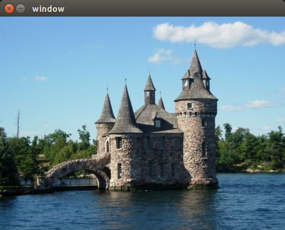
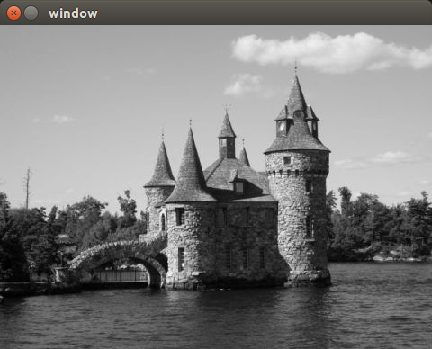
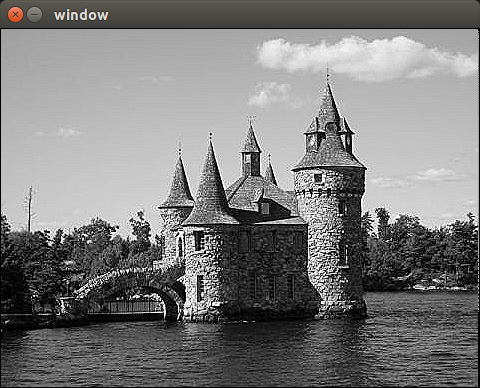

> 在图像处理中，通过当前位置的相邻像素计算新的像素值是很常见的操作。

## 图像锐化
基于拉普拉斯算子，`将一幅图像减去它经过拉普拉斯滤波之后的图像，这幅图像的边缘部分得到放大，即细节部分更加锐利。`这个锐化算子的计算方法如下：
```
sharpened_pixel=5*current-left-right-up-down;
//left代表在当前像素左边紧挨着它的像素，up代表上边...
```
图像锐化的处理过程不能以`In-place`的方式，用户必须提供一个输出图像。
图像遍历使用到了三个指针：分别指向当前行/上一行/下一行。
由于每个像素值的计算都需要它的上下左右四个邻居像素，所以，不可能对图像的第一行/最后一行/第一列/最后一列进行计算。

```
/*对灰度图进行的锐化处理*/
void sharpen(const cv::Mat &image, cv::Mat &result){
    result.create(image.size(),image.type());  //create a new image.
    for(int i=1;i<image.rows-1;i++){  //deal with 1 to rows-1.
        const uchar *previous=image.ptr<const uchar>(i-1);  //last row.
        const uchar *current=image.ptr<const uchar>(i);  //current row.
        const uchar *next=image.ptr<const uchar>(i+1);  //next row.
        uchar *output=result.ptr<uchar>(i);  //output row.
        for(int j=1;j<image.cols-1;j++){
            *output++=cv::saturate_cast<uchar>(5*current[j]-current[j-1]-current[j+1]-previous[j]-next[j]);
        }
    }
    //Set the unprocess pixels to 0.
    result.row(0).setTo(cv::Scalar(0));
    result.row(result.rows-1).setTo(cv::Scalar(0));
    result.col(0).setTo(cv::Scalar(0));
    result.col(result.cols-1).setTo(cv::Scalar(0));
}
```

原理：  
在计算输出像素值时，模板函数`cv::saturate_cast`被用来对计算结果进行截断。因为对像素值进行数学计算经常导致超出像素允许的取值范围，即小于0或大于255。解决方法是将值映射到0～255。通常的做法是将负值截断为0,将大于255的值截断为255。这也正是函数`cv::saturate_cast`所做的。  
边缘像素之所以不能处理是因为它们的邻域不完整，所以需要单独处理。

方法`row()`和`col()`，它们返回一个特殊的/仅包含一行或一列的`cv::Mat`实例。
`setTo()`函数用来设置矩阵的值，这个函数将矩阵的所有元素都设定为指定的值。
对于一个三通道的彩色图像，需要使用`cv::Scalar(a,b,c)`来指定像素三个通道的目标值。






## 锐化滤波器
其核矩阵为
```
0 -1 0
-1 5 -1
0 -1 0
```
当前像素点对应核矩阵的中心。  
一个核定义了一个图像滤波器。由于`滤波`是一个常规的图像处理方法，OpenCV定义了一个特殊的函数来完成滤波处理：`cv::filter2D`。在使用它之前，必须先以矩阵的形式定义一个核。之后以一幅图像和这个核为参数调用此函数，函数返回滤波后的图像。

利用图像滤波器来重写图像锐化函数：

```
void sharpen2D(const cv::Mat &image,cv::Mat &result){
    cv::Mat kernel(3,3,CV_32F,cv::Scalar(0));
    kernel.at<float>(1,1)=5.0;
    kernel.at<float>(0,1)=-1.0;
    kernel.at<float>(2,1)=-1.0;
    kernel.at<float>(1,0)=-1.0;
    kernel.at<float>(1,2)=-1.0;

    cv::filter2D(image,result,image.depth(),kernel);
}
```
