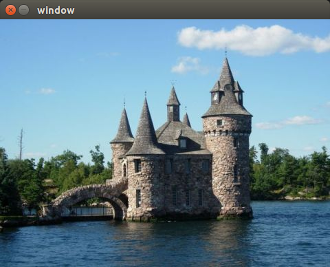

## 图像滤波

> `滤波（filtering）`：是信号处理及图像处理中的一个基本操作，旨在特定的应用程序中，选择性地提取图像中被认为传达重要信息的部分。  
滤波去除图像中的噪声，提取感兴趣的视觉特征，允许图像重采样，等等。

> `频域`：通过观察图像中变化的频率构成了另一种描述图像的方式。  
> `空间域`：通过观察灰度分布来描述一幅图像。

> `频域分析` 按照高频到低频的次序，分解图像到频率内容。  
低频对应区域的图像强度变化缓慢;
高频是由快速变化的图像强度生成的。  

> 由于图像是二维的，它包含`垂直频率`（垂直方向的变化）和`水平频率`（水平方向的变化）。

> 在频域分析的框架下，滤波操作的作用是增强部分频段，同时限制（或衰减）其他频段。  
`低通滤波器(Low-pass)`：去除图像中的高频成分;  
`高通滤波器(High-pass)`：去除图像中的低频成分。

## 低通滤波器
低通滤波器的目标是`降低图像变化的幅度`。  
一种简单的方案是：将每个像素替换为相邻像素的平均值（通过这么做，快速的强度变化被转化为平缓的过渡）。

### `cv::blur()`函数
`cv::blur()`函数的作用正是将每个像素替换为相邻矩形内像素的平均值。   
这类滤波器又被称为`箱式滤波器`。

用法：  
```
cv::blur(image,result,cv::Size(5,5));
```

举例：
```
std::string dir="/home/ld/Documents/learn/opencv_qt_learn/opencv2-book-src/images/";
cv::Mat image=cv::imread(dir+"boldt.jpg");
cv::namedWindow("image");
cv::imshow("image",image);
cv::waitKey();
cv:Mat result;
cv::blur(image,result,cv::Size(5,5));
cv::imshow("result",result);
cv::waitKey();
```




### `cv::GaussianBlur()`高斯函数
在一些情况下，对于靠近的像素需要给予更多的重要性。可以通过计算加权平均数，即离得近的像素相比远处的像素拥有更多的权重。  
常用的加权方案基于高斯函数（Gaussian Function），这是一个“钟形的”函数。`cv::GaussianBlur`函数便起到这个作用，用法：
```
cv::GaussianBlur(image,result,cv::Size(5,5),1.5);
```


## 滤波原理
当滤波器的作用相当于将一个像素替换为相邻像素的加权总和时，称为线性的。  
箱式滤波器即属于线性的。它将一个像素替换为相邻矩形内的像素和，并除以像素个数（以得到平均值）。  

滤波器的不同权重可以通过矩阵表示，矩阵的每一项都是对应位置像素的相乘因子。位于中心的元素对应的是滤波器当前正处理的像素。这样的矩阵被称为`核（Kernel）`或`掩码（Mask）`。  
应用一个线性滤波器意味着沿着图像的每个像素移动一个核，并且把每个对应的像素乘上关联的权重。在数学上，这个过程被称为`卷积（Convolution）`。  
低通滤波器的效果是`对图像进行模糊或平滑`，因为它减弱了物体边缘处可见的快速变化。
