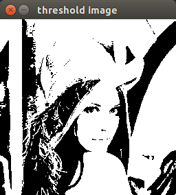

参考：
http://blog.jobbole.com/84220/

## 形态学滤波

腐蚀和膨胀是最基本的形态学运算。

数学形态学中最基本的工具是结构元素。结构元素简单地定义为像素的结构（形状），以及一个原点。
使用形态学滤波涉及对图像的每个像素应用这个结构元素。
当结构元素的原点与给定的像素对齐时，它与图像的相交部分定义了一组进行形态学运算的像素。
原则上，结构元素可以是任何形状，通常使用简单的形状，如方形/圆形/菱形，而原点位于中心位置。

形态学滤波通常使用于`二值图像`。
由于形态学惯例是，用高（白色）像素表示前景物体，用低（黑色）像素表示背景，需要对二值图像取反。

## 腐蚀和膨胀运算
`cv::erode()`实现腐蚀
`cv::dilate()`实现膨胀

应用1:二值图像的腐蚀和膨胀
```
cv::Mat image=cv::imread("/home/ld/Documents/lena.jpg");
cv::namedWindow("rgb image");
cv::imshow("rgb image",image);
cv::waitKey();

cv::Mat gray;
cv::cvtColor(image,gray,CV_BGR2GRAY);  //RGB convert to GRAY.
cv::namedWindow("gray image");
cv::imshow("gray image",gray);
cv::waitKey();

cv::Mat threshold_image;
int threshold=100;
cv::threshold(gray,threshold_image,threshold,255,cv::THRESH_BINARY);
cv::namedWindow("threshold image");
cv::imshow("threshold image",threshold_image);
cv::waitKey();

cv::Mat binary_image;
threshold_image.copyTo(binary_image);
cv::Mat erode_image;
cv::erode(binary_image,erode_image,cv::Mat());
//cv::erode(gray,erode_image,cv::Mat());
cv::namedWindow("erode image");
cv::imshow("erode image",erode_image);
cv::waitKey();

cv::Mat dilate_image;
cv::dilate(binary_image,dilate_image,cv::Mat());
//cv::dilate(gray,dilate_image,cv::Mat());
cv::imshow("dilate image",dilate_image);
cv::waitKey();
```





应用2：灰度图的腐蚀和膨胀
```
cv::Mat image=cv::imread("/home/ld/Documents/lena.jpg");
cv::namedWindow("rgb image");
cv::imshow("rgb image",image);
cv::waitKey();

cv::Mat gray;
cv::cvtColor(image,gray,CV_BGR2GRAY);  //RGB convert to GRAY.
cv::namedWindow("gray image");
cv::imshow("gray image",gray);
cv::waitKey();

cv::Mat threshold_image;
int threshold=100;
cv::threshold(gray,threshold_image,threshold,255,cv::THRESH_BINARY);
cv::namedWindow("threshold image");
cv::imshow("threshold image",threshold_image);
cv::waitKey();

cv::Mat binary_image;
threshold_image.copyTo(binary_image);
cv::Mat erode_image;
//cv::erode(binary_image,erode_image,cv::Mat());
cv::erode(gray,erode_image,cv::Mat());
cv::namedWindow("erode image");
cv::imshow("erode image",erode_image);
cv::waitKey();

cv::Mat dilate_image;
//cv::dilate(binary_image,dilate_image,cv::Mat());
cv::dilate(gray,dilate_image,cv::Mat());
cv::imshow("dilate image",dilate_image);
cv::waitKey();
```


应用3：rgb图的腐蚀和膨胀
```
cv::Mat image=cv::imread("/home/ld/Documents/lena.jpg");
cv::namedWindow("rgb image");
cv::imshow("rgb image",image);
cv::waitKey();

cv::Mat gray;
cv::cvtColor(image,gray,CV_BGR2GRAY);  //RGB convert to GRAY.
cv::namedWindow("gray image");
cv::imshow("gray image",gray);
cv::waitKey();

cv::Mat threshold_image;
int threshold=100;
cv::threshold(gray,threshold_image,threshold,255,cv::THRESH_BINARY);
cv::namedWindow("threshold image");
cv::imshow("threshold image",threshold_image);
cv::waitKey();

cv::Mat binary_image;
threshold_image.copyTo(binary_image);
cv::Mat erode_image;
//cv::erode(binary_image,erode_image,cv::Mat());
//cv::erode(gray,erode_image,cv::Mat());
cv::erode(image,erode_image,cv::Mat());
cv::namedWindow("erode image");
cv::imshow("erode image",erode_image);
cv::waitKey();

cv::Mat dilate_image;
//cv::dilate(binary_image,dilate_image,cv::Mat());
//cv::dilate(gray,dilate_image,cv::Mat());
cv::dilate(image,dilate_image,cv::Mat());
cv::imshow("dilate image",dilate_image);
cv::waitKey();
```


> Note: OpenCV的 erode 函数还有另外的参数，其中一个参数允许你一下对图像进行多次腐蚀操作。
