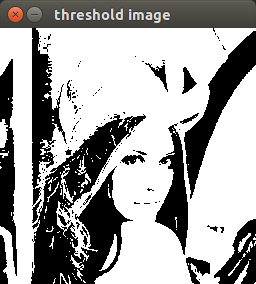

 二值图像(Binary Image)，按名字来理解只有两个值，0和1，0代表黑，1代表白，或者说0表示背景，而1表示前景。其保存也相对简单，每个像素只需要1Bit就可以完整存储信息。如果把每个像素看成随机变量，一共有N个像素，那么二值图有2的N次方种变化，而8位灰度图有255的N次方种变化，8为三通道RGB图像有255*255*255的N次方种变化。也就是说同样尺寸的图像，二值图保存的信息更少。




 图中，彩色图像和灰度图像很好的可以看出右侧的镜子，而二值图像无法看出，根据信息论的相关知识，也可以得出二值图像有很大的信息损失，上图中二值图像由灰度图经过阈值100处理后得到的结构。  
 黑色部分是背景，白色部分是前景。

```
    cv::Mat image=cv::imread("/home/ld/Documents/lena.jpg");
    cv::namedWindow("rgb image");
    cv::imshow("rgb image",image);
    cv::waitKey();

    cv::Mat gray;
    cv::cvtColor(image,gray,CV_BGR2GRAY);  //RGB convert to GRAY.
    cv::namedWindow("gray image");
    cv::imshow("gray image",gray);
    cv::waitKey();

    cv::Mat threshold_image;
    int threshold=100;
    cv::threshold(gray,threshold_image,threshold,255,cv::THRESH_BINARY);
    cv::namedWindow("threshold image");
    cv::imshow("threshold image",threshold_image);
    cv::waitKey();
```

`cv::threshold()`的用法见
http://www.opencv.org.cn/opencvdoc/2.3.2/html/doc/tutorials/imgproc/threshold/threshold.html
http://www.itnose.net/detail/6060285.html
