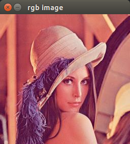
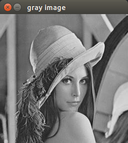
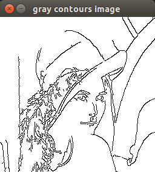

## 边缘检测
> 边缘包含着重要的视觉信息，因为它描绘出图像元素的轮廓。可用于物体检测。
简单的二值边缘图像（对梯度大小进行阈值化以得到二值的边缘图像）有两大缺陷：
（1）检测到的边缘过粗，这意味着难以实现物体的精确定位。
（2）难以找到这样一个阈值，既能足够低以检测到所有重要边缘，同时又不至于包含过多次要的边缘。这个需要权衡的问题正是Canny算法尝试解决的。

## Canny算法在OpenCV中的实现：`cv::Canny`函数
核心思想是使用两个不同阈值以确定哪些点属于轮廓：一个低值和一个高值。

```
cv::Mat image=cv::imread("/home/ld/Documents/lena.jpg");
cv::namedWindow("rgb image");
cv::imshow("rgb image",image);
cv::waitKey();

cv::Mat gray;
cv::cvtColor(image,gray,CV_BGR2GRAY);  //RGB convert to GRAY.
cv::namedWindow("gray image");
cv::imshow("gray image",gray);
cv::waitKey();

/*
cv::Mat cat_edge;
cv::morphologyEx(gray,cat_edge,MORPH_GRADIENT,Mat());
cv::namedWindow("cat edge");
cv::imshow("cat edge",cat_edge);
cv::waitKey();
cv::threshold(cat_edge,cat_edge,40,255,THRESH_BINARY);
cv::imshow("cat edge",cat_edge);
*/

//Canny()函数
cv::Mat contours;
cv::Canny(gray,contours,125,350);
cv::namedWindow("gray contours image");
cv::imshow("gray contours image",contours);
cv::waitKey();

//反转黑白值，因为正常情况下轮廓用非零像素表示。
//反转后的图像更适合打印在纸上。
cv::Mat contoursInv;
cv::threshold(contours,contoursInv,128,255,cv::THRESH_BINARY_INV);
cv::imshow("gray contours image",contoursInv);
cv::waitKey();
```



