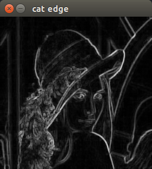
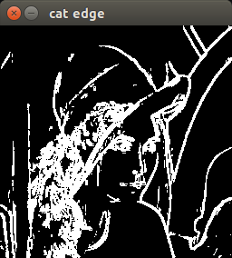

## 边缘检测
> 检测图像边缘：对梯度大小进行阈值化以得到二值的边缘图像。
```
cv::Mat image=cv::imread("/home/ld/Documents/lena.jpg");
cv::namedWindow("rgb image");
cv::imshow("rgb image",image);
cv::waitKey();

cv::Mat gray;
cv::cvtColor(image,gray,CV_BGR2GRAY);  //RGB convert to GRAY.
cv::namedWindow("gray image");
cv::imshow("gray image",gray);
cv::waitKey();

cv::Mat cat_edge;
cv::morphologyEx(gray,cat_edge,MORPH_GRADIENT,Mat());
cv::namedWindow("gray image cat edge");
cv::imshow("gray image cat edge",gray);
cv::threshold(cat_edge,cat_edge,40,255,THRESH_BINARY);
cv::namedWindow("cat edge");
cv::imshow("cat edge",cat_edge);
cv::waitKey();
```






`cv::morphologyEx()`函数，得到图像的梯度大小，是实现边缘检测的基础，详见文档。
http://www.opencv.org.cn/opencvdoc/2.3.2/html/doc/tutorials/imgproc/opening_closing_hats/opening_closing_hats.html#morphology-2
