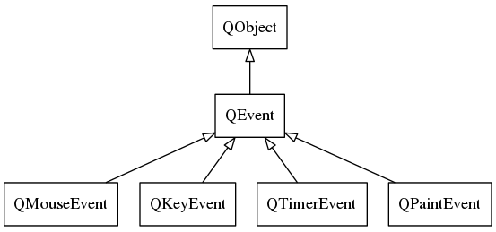

## QEvent

> QObjects receive events by having their QObject::event() function called. The function can be reimplemented in subclasses to customize event handling and add additional event types; QWidget::event() is a notable example. By default, events are dispatched to event handlers like QObject::timerEvent() and QWidget::mouseMoveEvent(). QObject::installEventFilter() allows an object to intercept events destined for another object.

## QKeyEvent键盘事件

## QTimerEvent定时器事件
其实看Qt文档就够了。
