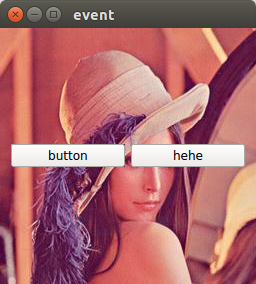

## 事件处理

### paintEvent()
```
#ifndef WIDGET_H
#define WIDGET_H

#include <QWidget>
#include <QPushButton>

class Widget : public QWidget
{
    Q_OBJECT

public:
    Widget(QWidget *parent = 0);
    ~Widget();

protected:
    virtual void paintEvent ( QPaintEvent * event);
private:
    QPixmap *pixmap;
    QPushButton *button;

};

#endif // WIDGET_H

```


```
#include "widget.h"

#include <QPaintEvent>
#include <QPainter>
#include <QPixmap>
#include <QPushButton>
#include <QHBoxLayout>

Widget::Widget(QWidget *parent)
    : QWidget(parent)
{
    button=new QPushButton(this);
    button->setText("button");

    QPushButton *but=new QPushButton(this);
    but->setText("hehe");

    QHBoxLayout *layout=new QHBoxLayout();
    layout->addWidget(button);
    layout->addWidget(but);
    this->setLayout(layout);

    pixmap=new QPixmap(":/image/lena.jpg");
    this->resize(pixmap->size());
}

Widget::~Widget()
{

}

void Widget::paintEvent(QPaintEvent *event)
{
    //QPixmap pixmap(":/image/lena.jpg");
    QPainter painter(this);
    painter.drawPixmap(event->rect(), *pixmap);
}

```

输出结果为：

