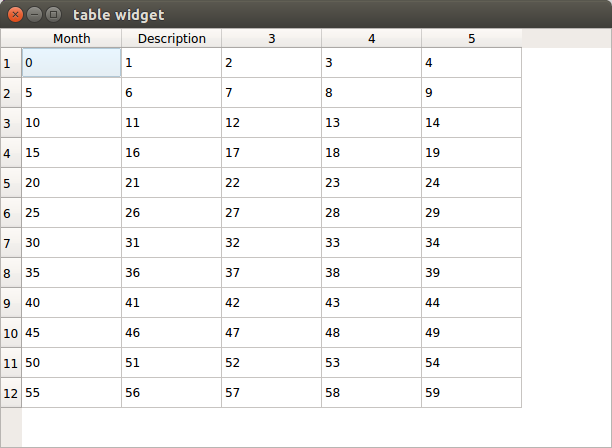

```
#include <QApplication>
#include <QString>
#include <QTableWidget>
#include <QTableWidgetItem>

int main(int argc, char *argv[])
{
    QApplication a(argc, argv);
    QTableWidget *table;
//    table=new QTableWidget(12,5);
    table=new QTableWidget();
    table->setRowCount(12);
    table->setColumnCount(5);
    table->setWindowTitle("table widget");
    table->resize(350,200);
    table->show();

//设置行标题
    QStringList header;
    header<<"Month"<<"Description";
    table->setHorizontalHeaderLabels(header);

    int value=0;
    for(int row=0;row<table->rowCount();row++){
        for(int column=0;column<table->columnCount();column++){
            QTableWidgetItem *item=new QTableWidgetItem();
            item->setText(QString::number(value,10));
            table->setItem(row,column,item);
            value++;
        }
    }

    return a.exec();
}
```

