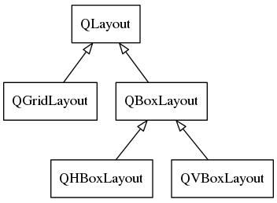

## layout

布局统一由QLayout类表示，它为基类，派生出所有具体的布局类型。   
常用的布局有:水平布局、垂直布局和栅格布局，它们分别由`QHBoxLayout`类，`QVBoxLayout`类和`QGridLayout`类代表。类的继承关系:



布局并不是窗口类，因此布局内放入窗口部件和放入布局的函数是不同的，一个是`addWidget`，一个是`addLayout`。  

对于一个窗口来说，只能有一个布局成为它的顶级布局，这可以通过向布局的构造函数传递QWidget类的指针来实现，也可以通过QWidget类的以下成员函数实现：

```  

//将布局layout设为窗口的顶级布局
void setLayout(QLayout *layout)

```


栅格布局的`addWidget`函数原型与水平布局和垂直布局是不同的，参数上需要指明行号和列号。
```

void addLayout(QLayout *layout, int row, int column);  
```
