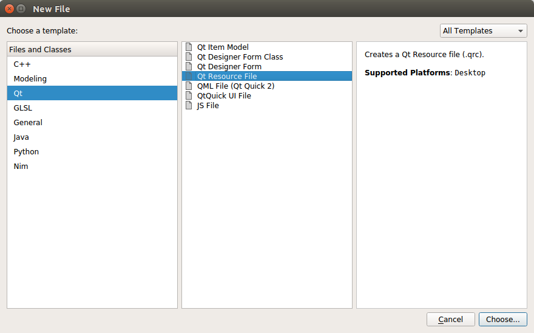
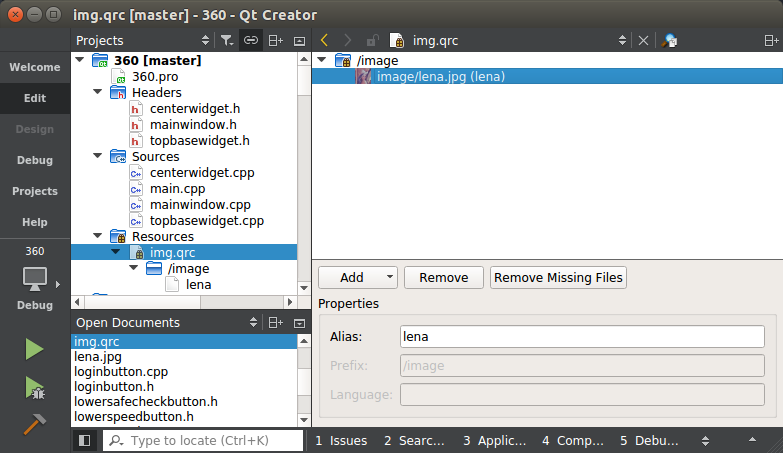

## Qt 资源文件
> 编写gui可能需要一些额外的资源（如贴图用的图片），可用资源文件统一管理。

命名为“项目名.prc”,系统自动切换到资源编辑界面：

选择添加 — 添加前缀，前缀名默认为“/new/prefix1”，改为在前缀一栏输入前缀名“/image”。

选中“/image”（如果只建立了image一个资源文件则自动选中），选择添加 — 添加文件，然后选中lena.jpg(或其他图片)。

添加资源文件后要保存，不然之后不能使用。在上述界面中选中资源文件lena.jpg，可以为其起别名lena，方便使用。
